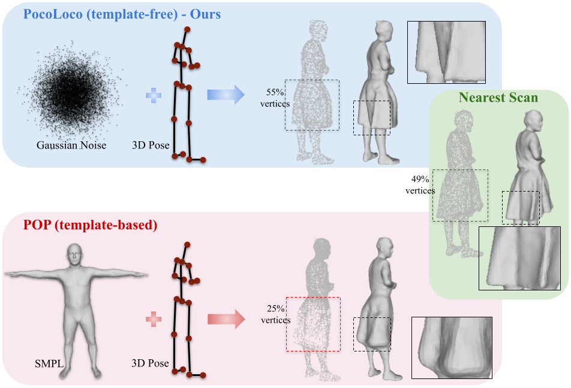

# PocoLoco: A Point Cloud Diffusion Model of Human Shape in Loose Clothing

### WACV 2025

### Project Page  | Paper

**[Siddharth Seth](https://sidsunny.github.io/)1, [Rishabh Dabral](https://rishabhdabral.github.io/)2, [Diogo Luvizon](https://dluvizon.github.io/)2, [Marc Habermann](https://people.mpi-inf.mpg.de/~mhaberma/)2, [Ming-Hsuan Yang](https://faculty.ucmerced.edu/mhyang/)1, [Christian Theobalt](https://people.mpi-inf.mpg.de/~theobalt/)2, [Adam Kortylewski](https://genintel.mpi-inf.mpg.de/)2,3**  
1UC Merced, 2Max Planck Institute for Informatics, 3University of Freiburg

 

    
Abstract (click to view)

    Modeling a human avatar that can plausibly deform to articulations is an active area of research. We present POCOLOCO – the first template-free, point-based, pose-conditioned generative model for 3D humans in loose clothing. We motivate our work by noting that most methods require a parametric model of the human body to ground pose-dependent deformations. Consequently, they are restricted to modeling clothing that is topologically similar to the naked body and do not extend well to loose clothing. The few methods that attempt to model loose clothing typically require either canonicalization or a UV-parameterization and need to address the challenging problem of explicitly estimating correspondences for the deforming clothes. In this work, we formulate avatar clothing deformation as a conditional point-cloud generation task within the denoising diffusion framework. Crucially, our framework operates directly on unordered point clouds, eliminating the need for a parametric model or a clothing template. This also enables a variety of practical applications, such as point cloud completion and pose-based editing – important features for virtual human animation. As current datasets for human avatars in loose clothing are far too small for training diffusion models, we release a dataset of two subjects performing various poses in loose clothing with a total of 75K point clouds. By contributing towards tackling the challenging task of effectively modeling loose clothing and expanding the available data for training these models, we aim to set the stage for further innovation in digital humans.

## Code setup
To be released soon
